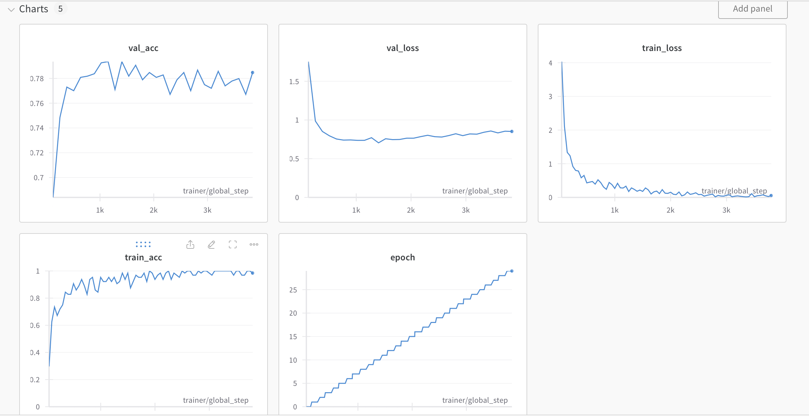
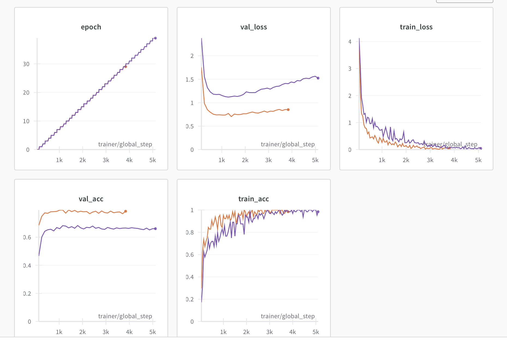
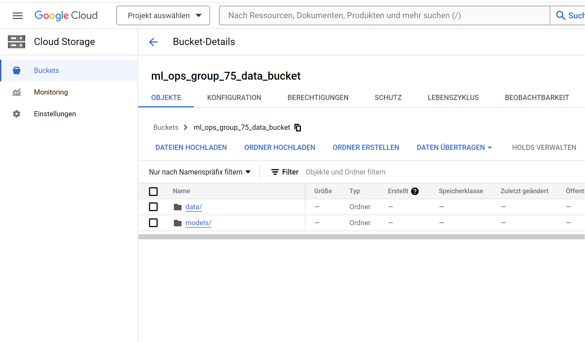

# Exam template for 02476 Machine Learning Operations

This is the report template for the exam. Please only remove the text formatted as with three dashes in front and behind
like:

```--- question 1 fill here ---```

where you instead should add your answers. Any other changes may have unwanted consequences when your report is auto
generated in the end of the course. For questions where you are asked to include images, start by adding the image to
the `figures` subfolder (please only use `.png`, `.jpg` or `.jpeg`) and then add the following code in your answer:

```markdown

```

In addition to this markdown file, we also provide the `report.py` script that provides two utility functions:

Running:

```bash
python report.py html
```

will generate an `.html` page of your report. After deadline for answering this template, we will autoscrape
everything in this `reports` folder and then use this utility to generate an `.html` page that will be your serve
as your final handin.

Running

```bash
python report.py check
```

will check your answers in this template against the constrains listed for each question e.g. is your answer too
short, too long, have you included an image when asked to.

For both functions to work it is important that you do not rename anything. The script have two dependencies that can
be installed with `pip install click markdown`.

## Overall project checklist

The checklist is *exhaustic* which means that it includes everything that you could possible do on the project in
relation the curricilum in this course. Therefore, we do not expect at all that you have checked of all boxes at the
end of the project.

### Week 1

* [X] Create a git repository
* [X] Make sure that all team members have write access to the github repository
* [X] Create a dedicated environment for you project to keep track of your packages
* [X] Create the initial file structure using cookiecutter
* [X] Fill out the `make_dataset.py` file such that it downloads whatever data you need and
* [X] Add a model file and a training script and get that running
* [X] Remember to fill out the `requirements.txt` file with whatever dependencies that you are using
* [X] Remember to comply with good coding practices (`pep8`) while doing the project
* [X] Do a bit of code typing and remember to document essential parts of your code
* [X] Setup version control for your data or part of your data
* [X] Construct one or multiple docker files for your code
* [X] Build the docker files locally and make sure they work as intended
* [X] Write one or multiple configurations files for your experiments
* [X] Used Hydra to load the configurations and manage your hyperparameters
* [X] When you have something that works somewhat, remember at some point to to some profiling and see if
      you can optimize your code
* [X] Use Weights & Biases to log training progress and other important metrics/artifacts in your code. Additionally,
      consider running a hyperparameter optimization sweep.
* [X] Use Pytorch-lightning (if applicable) to reduce the amount of boilerplate in your code

### Week 2

* [X] Write unit tests related to the data part of your code
* [X] Write unit tests related to model construction and or model training
* [X] Calculate the coverage.
* [X] Get some continuous integration running on the github repository
* [X] Create a data storage in GCP Bucket for you data and preferable link this with your data version control setup
* [X] Create a trigger workflow for automatically building your docker images
* [X] Get your model training in GCP using either the Engine or Vertex AI
* [X] Create a FastAPI application that can do inference using your model
* [X] If applicable, consider deploying the model locally using torchserve
* [X] Deploy your model in GCP using either Functions or Run as the backend

### Week 3

* [ ] Check how robust your model is towards data drifting
* [ ] Setup monitoring for the system telemetry of your deployed model
* [X] Setup monitoring for the performance of your deployed model
* [X] If applicable, play around with distributed data loading
* [ ] If applicable, play around with distributed model training
* [ ] Play around with quantization, compilation and pruning for you trained models to increase inference speed

### Additional

* [X] Revisit your initial project description. Did the project turn out as you wanted?
* [X] Make sure all group members have a understanding about all parts of the project
* [X] Uploaded all your code to github

## Group information

### Question 1
> **Enter the group number you signed up on <learn.inside.dtu.dk>**
>
> Answer:

75

### Question 2
> **Enter the study number for each member in the group**
>
> Example:
>
> *sXXXXXX, sXXXXXX, sXXXXXX*
>
> Answer:

s223322, s230241, s222887, s232050

### Question 3
> **What framework did you choose to work with and did it help you complete the project?**
>
> Answer length: 100-200 words.
>
> Example:
> *We used the third-party framework ... in our project. We used functionality ... and functionality ... from the*
> *package to do ... and ... in our project*.
>
> Answer:

We used the third-party framework TIMM in our project. First, we loaded a pretrained resnet18 model from it (finally changed to resnet50) and modified its final classification layer to fine-tune the model using our own dataset. We also used `LabelSmoothingCrossEntropy` from `timm.loss.cross_entropy` as our loss function which, according to documentation, is similar to NLL, but, as the name suggests, includes label smoothing, that takes the fact into account that there might be some incorrect labels in the dataset. For configuring the optimization process we used the `create_optimizer_v2` function from `timm.optim.optim_factory` with `NAdamW` as an optimizer.

## Coding environment

> In the following section we are interested in learning more about you local development environment.

### Question 4

> **Explain how you managed dependencies in your project? Explain the process a new team member would have to go**
> **through to get an exact copy of your environment.**
>
> Answer length: 100-200 words
>
> Example:
> *We used ... for managing our dependencies. The list of dependencies was auto-generated using ... . To get a*
> *complete copy of our development environment, one would have to run the following commands*
>
> Answer:

We were using conda environments to manage the dependencies. We created a `requirements.txt` file to store the dependencies, as well as `requirements_api.txt` to store requirements of API and model deployment. Similarly, `requirements_dev.txt` and `requirements_tests.txt` include dependencies used for development and testing. We used `pipreqs` module for auto-generation of the dependencies. We also used `pyproject.toml` to describe project metadata, linked the `requirements.txt` file there, specified python version and configured `ruff` options in it. To get a complete copy of the environment, the following commands would have to be run:

```bash
git clone https://github.com/hrapek/ml_ops_dog_breeds.git
cd ml_ops_dog_breeds
conda create --name dog_breeds_env python=3.11.5
pip install .
dvc pull
```

### Question 5

> **We expect that you initialized your project using the cookiecutter template. Explain the overall structure of your**
> **code. Did you fill out every folder or only a subset?**
>
> Answer length: 100-200 words
>
> Example:
> *From the cookiecutter template we have filled out the ... , ... and ... folder. We have removed the ... folder*
> *because we did not use any ... in our project. We have added an ... folder that contains ... for running our*
> *experiments.*
> Answer:

We used the `cookiecutter` template for our project. When using `dvc pull`, the `data/` folder is filled with raw data. This data can then be used in `make_dataset.py` to generate the processed data,  divided into training, validation and test sets. In the `models/` folder we store a checkpoint with a trained model and user it as a `model_store` for torchserve. A source code folder in our case has a name `ml_ops_dog_breeds/`. In there we have scripts for training and predictions, torchserve custom handler and config files specifying hyperparameters and model parameters, folder `ml_ops_dog_breeds/data/` with scripts processing the raw data, and folder `ml_ops_dog_breeds/models/` with script containing the model class. We also added a new folder there, called `ml_ops_dog_breeds/api/`, that contains scripts with `FastAPI` application. We have filled folder dockerfiles with separate files for training, inference and api. In the folder `tests/` we added three scripts for testing the data, model and training. We also have `.github/workflows/` files that provides github actions with two workflows. Besides that we have a few files in the root directory, such as `requirements*.txt` files, `cloudbuild.yaml` or `pre-commit` file.

### Question 6

> **Did you implement any rules for code quality and format? Additionally, explain with your own words why these**
> **concepts matters in larger projects.**
>
> Answer length: 50-100 words.
>
> Answer:

We use pre-commit to enforce some format rules, using various hooks and also calling `ruff`, in order to ensure compliance with pep8.

Especially in larger projects and large teams, it is very important to have standards for formating and other structures so it is easier for someone to look for information in other peoples code and ensure that code style is consistent across the entire repo when many people are contributiing, and various rules should be followed.

## Version control

> In the following section we are interested in how version control was used in your project during development to
> corporate and increase the quality of your code.

### Question 7

> **How many tests did you implement and what are they testing in your code?**
>
> Answer length: 50-100 words.
>
> Example:
> *In total we have implemented X tests. Primarily we are testing ... and ... as these the most critical parts of our*
> *application but also ... .*
>
> Answer:

In the `tests/test_*.py` files we have implemented 8 tests in the areas data, model and training.
Regarding data, we check that the processed data gets generated without any exception, we check the number of samples, the shape of the imagers and labels, the range of labels and the normalization of the data.
Furthermore, regarding the model, we check that the forward pass does not throw exceptions, check the shape of model predictions and that the parameters of the model are floating point numbers.
Finally, regarding training, we test the gradient computation.

### Question 8

> **What is the total code coverage (in percentage) of your code? If you code had an code coverage of 100% (or close**
> **to), would you still trust it to be error free? Explain you reasoning.**
>
> Answer length: 100-200 words.
>
> Example:
> *The total code coverage of code is X%, which includes all our source code. We are far from 100% coverage of our **
> *code and even if we were then...*
>
> Answer:

--- question 8 fill here ---

### Question 9

> **Did you workflow include using branches and pull requests? If yes, explain how. If not, explain how branches and**
> **pull request can help improve version control.**
>
> Answer length: 100-200 words.
>
> Example:
> *We made use of both branches and PRs in our project. In our group, each member had an branch that they worked on in*
> *addition to the main branch. To merge code we ...*
>
> Answer:

We only used branches in a very limited capacity, mostly because possible overhead in this project might have been bigger that communicating which area each person is working on, because they were generally seperate.
In larger or more complex project, a seperate branch for each feature getting implemented would be more suited and pull requests would allow other group members to check the code before merging it, ensuring the main branch is always clean. In our case, we used branches to make some changes to the model, training scripts and configs, which we could then pull and test from the compute engine, before merging it to main.

### Question 10

> **Did you use DVC for managing data in your project? If yes, then how did it improve your project to have version**
> **control of your data. If no, explain a case where it would be beneficial to have version control of your data.**
>
> Answer length: 100-200 words.
>
> Example:
> *We did make use of DVC in the following way: ... . In the end it helped us in ... for controlling ... part of our*
> *pipeline*
>
> Answer:

We did use DVC in this project. It was used for the raw data to provide a way we could have the data in a cloud storage that we have control over (in contrast to a direct import from keggle) and can still separate from the code and github.
It also allowed us to push model checkpoints after training.
In our case we did not really make use of the version control aspect provided by dvc since we did not change the data while working on the project. However, if we were to store processed images after applying transformations, this aspect could be particularly useful when testing different transformations.

### Question 11

> **Discuss you continues integration setup. What kind of CI are you running (unittesting, linting, etc.)? Do you test**
> **multiple operating systems, python version etc. Do you make use of caching? Feel free to insert a link to one of**
> **your github actions workflow.**
>
> Answer length: 200-300 words.
>
> Example:
> *We have organized our CI into 3 separate files: one for doing ..., one for running ... testing and one for running*
> *... . In particular for our ..., we used ... .An example of a triggered workflow can be seen here: <weblink>*
>
> Answer:

We used `ruff` for linting and `pytest` for unittesting. We setup pre-commit to run  serveral checks and `ruff`.
In addition, using github actions, we are running our unittests, testing on linux, mac and windows. We use caching for the dependencies and for the data pulling.

TODO: longer

## Running code and tracking experiments

> In the following section we are interested in learning more about the experimental setup for running your code and
> especially the reproducibility of your experiments.

### Question 12

> **How did you configure experiments? Did you make use of config files? Explain with coding examples of how you would**
> **run a experiment.**
>
> Answer length: 50-100 words.
>
> Example:
> *We used a simple argparser, that worked in the following way: python my_script.py --lr 1e-3 --batch_size 25*
>
> Answer:

For managing experiments configuration we decided to use `hydra` and config files. We have two separate config files, one for specifying training parameters (number of epochs, batch size etc.) and one for model parameters (i.e. name of pretrained model and number of output features). In general it's sufficient to change values in the config files and run the experiment using `python ml_ops_dog_breeds/train_model.py`. It's important to remember that this assumes that we have already processed data. Otherwise, we first need to run `python ml_ops_dog_breeds/make_dataset.py`.

### Question 13

> **Reproducibility of experiments are important. Related to the last question, how did you secure that no information**
> **is lost when running experiments and that your experiments are reproducible?**
>
> Answer length: 100-200 words.
>
> Example:
> *We made use of config files. Whenever an experiment is run the following happens: ... . To reproduce an experiment*
> *one would have to do ...*
>
> Answer:

We ensured the reproducibiity of our experiments by loging data to weight and biases which could later be inspected and compared to other runs. We save model checkpoints for each training experiment and using hydra we stored the crresponding configuration for each of the experiment.

### Question 14

> **Upload 1 to 3 screenshots that show the experiments that you have done in W&B (or another experiment tracking**
> **service of your choice). This may include loss graphs, logged images, hyperparameter sweeps etc. You can take**
> **inspiration from [this figure](figures/wandb.png). Explain what metrics you are tracking and why they are**
> **important.**
>
> Answer length: 200-300 words + 1 to 3 screenshots.
>
> Example:
> *As seen in the first image when have tracked ... and ... which both inform us about ... in our experiments.*
> *As seen in the second image we are also tracking ... and ...*
>
> Answer:




The first figure shows an example run, we logged training and validation loss and accuracy.
The second run shows a comparison between two runs.
These metrics are important to see how the model is learning, especially since, for each run,  we save the model which acheived the lowest validation loss. They can be used to compare parameter and architecture choices.

### Question 15

> **Docker is an important tool for creating containerized applications. Explain how you used docker in your**
> **experiments? Include how you would run your docker images and include a link to one of your docker files.**
>
> Answer length: 100-200 words.
>
> Example:
> *For our project we developed several images: one for training, inference and deployment. For example to run the*
> *training docker image: `docker run trainer:latest lr=1e-3 batch_size=64`. Link to docker file: <weblink>*
>
> Answer:

To make sure that our code is reproducible we developed three dockerfiles: one for training, one for inference and one for api (deployment). For example, to run the deployment dockerfile, we first need to build an image using `docker build -t dog_breeds_fastapi_app -f dockerfiles/api.dockerfile .` and then, to run it, we need the following command: docker run -p 8080:8080 dog_breeds_fastapi_app. It's important to specify the port number when running a deployment docker image. Here's a link to dockerfile on github: [link](https://github.com/hrapek/ml_ops_dog_breeds/blob/main/dockerfiles/api.dockerfile). This dockerfile is also build in Google Cloud Build whenever there are new pushes to main branch and then deployed on Cloud Run.

### Question 16

> **When running into bugs while trying to run your experiments, how did you perform debugging? Additionally, did you**
> **try to profile your code or do you think it is already perfect?**
>
> Answer length: 100-200 words.
>
> Example:
> *Debugging method was dependent on group member. Some just used ... and others used ... . We did a single profiling*
> *run of our main code at some point that showed ...*
>
> Answer:

We did not have to perform any complex debugging while working on the project.
However, we used memory profiling on our `make_dataset.py` script because of a high memory consumption. This allowed us to reduce the maximum memory usage of the data processing and saving method from 10GB to 2GB, which was particularly helpful when running the code on the cloud.

## Working in the cloud

> In the following section we would like to know more about your experience when developing in the cloud.

### Question 17

> **List all the GCP services that you made use of in your project and shortly explain what each service does?**
>
> Answer length: 50-200 words.
>
> Example:
> *We used the following two services: Engine and Bucket. Engine is used for... and Bucket is used for...*
>
> Answer:

We used following services for our project:
- Compute Engine for training our model
- Buckets in Cloud Storage for storing the raw data and model checkpoint and added it to dvc
- Cloud Build for building docker images
- Artifact Registry for storing built images
- Cloud Run for deploying our model

### Question 18

> **The backbone of GCP is the Compute engine. Explained how you made use of this service and what type of VMs**
> **you used?**
>
> Answer length: 100-200 words.
>
> Example:
> *We used the compute engine to run our ... . We used instances with the following hardware: ... and we started the*
> *using a custom container: ...*
>
> Answer:

We used the compute engine for training. We chose the n1 machines, containing a GPU, 2 CPU cores and varied the ram amount up to 15GB depending on the task.
We setup the machine, as described previously in question 4, by cloning the repository, pulling the data and installing dependencies.

### Question 19

> **Insert 1-2 images of your GCP bucket, such that we can see what data you have stored in it.**
> **You can take inspiration from [this figure](figures/bucket.png).**
>
> Answer:

[GCP Bucket Screenshot (Link to File)](figures/ml_ops_group_75_data_bucket.png)

### Question 20

> **Upload one image of your GCP container registry, such that we can see the different images that you have stored.**
> **You can take inspiration from [this figure](figures/registry.png).**
>
> Answer:

--- question 20 fill here ---

### Question 21

> **Upload one image of your GCP cloud build history, so we can see the history of the images that have been build in**
> **your project. You can take inspiration from [this figure](figures/build.png).**
>
> Answer:

--- question 21 fill here ---

### Question 22

> **Did you manage to deploy your model, either in locally or cloud? If not, describe why. If yes, describe how and**
> **preferably how you invoke your deployed service?**
>
> Answer length: 100-200 words.
>
> Example:
> *For deployment we wrapped our model into application using ... . We first tried locally serving the model, which*
> *worked. Afterwards we deployed it in the cloud, using ... . To invoke the service an user would call*
> *`curl -X POST -F "file=@file.json"<weburl>`*
>
> Answer:

We deployed the model locally using torchserve. We used `torch.jit`, `torch-model-archiver` with a custom handler we implemented and passing-in
our serialized label encoder along with the model to convert from model predictions to breed names.

TODO Cloud deployment

### Question 23

> **Did you manage to implement monitoring of your deployed model? If yes, explain how it works. If not, explain how**
> **monitoring would help the longevity of your application.**
>
> Answer length: 100-200 words.
>
> Example:
> *We did not manage to implement monitoring. We would like to have monitoring implemented such that over time we could*
> *measure ... and ... that would inform us about this ... behaviour of our application.*
>
> Answer:

--- question 23 fill here ---

### Question 24

> **How many credits did you end up using during the project and what service was most expensive?**
>
> Answer length: 25-100 words.
>
> Example:
> *Group member 1 used ..., Group member 2 used ..., in total ... credits was spend during development. The service*
> *costing the most was ... due to ...*
>
> Answer:

Samy ended up using 13€ worth of credits on the project, using a storage bucket and the compute engine service. The compute engine service is way more expensive than the data storage.

TODO other members

## Overall discussion of project

> In the following section we would like you to think about the general structure of your project.

### Question 25

> **Include a figure that describes the overall architecture of your system and what services that you make use of.**
> **You can take inspiration from [this figure](figures/overview.png). Additionally in your own words, explain the**
> **overall steps in figure.**
>
> Answer length: 200-400 words
>
> Example:
>
> *The starting point of the diagram is our local setup, where we integrated ... and ... and ... into our code.*
> *Whenever we commit code and puch to github, it auto triggers ... and ... . From there the diagram shows ...*
>
> Answer:

--- question 25 fill here ---

### Question 26

> **Discuss the overall struggles of the project. Where did you spend most time and what did you do to overcome these**
> **challenges?**
>
> Answer length: 200-400 words.
>
> Example:
> *The biggest challenges in the project was using ... tool to do ... . The reason for this was ...*
>
> Answer:

One of the struggles in this project was bugfixing, mostly in code for or interaction with other systems for the ML Ops(e.g. DVC, github actions).
In particular we had some issues with DVC which did not work for all group members when using drive, which takes time pulling data and had some bugs such as nto stopping running even though all data has been pushed. 
Implementing the custom handler for torchserve was a bit more complex than expected because of some lacking documentation.

### Question 27

> **State the individual contributions of each team member. This is required information from DTU, because we need to**
> **make sure all members contributed actively to the project**
>
> Answer length: 50-200 words.
>
> Example:
> *Student sXXXXXX was in charge of developing of setting up the initial cookie cutter project and developing of the*
> *docker containers for training our applications.*
> *Student sXXXXXX was in charge of training our models in the cloud and deploying them afterwards.*
> *All members contributed to code by...*
>
> Answer:

All members contributed overall in sum equally to multiple areas in this project. In the following we will list main areas each person worked on:

s223322

s230241

s222887 data setup and processing scripts, local deployment with torchserve, model training, work on model class and training script, unittests

s232050 (Mike) worked on github actions and testing workflows, especially in the area of data pulling and caching as well as bugfixing. Additionally he worked on parts of this report.


|Student    |Contribution     |
|:----------|----------------:|
|s223322    | 25 %            |
|s230241    | 25 %            |
|s222887    | 25 %            |
|s232050    | 25 %            |
|Sum        | 100 %
